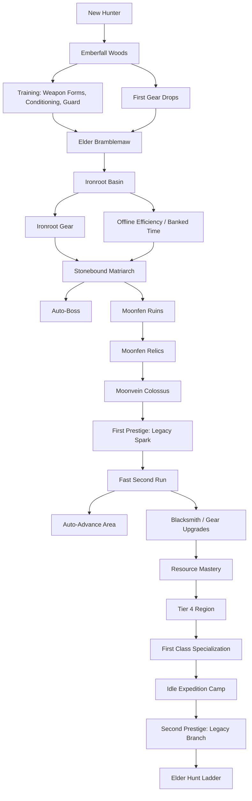

# First 100 Hours Progression Tree

This plan extends the current rebuild direction into the first 100 hours of idle play. In practice, that should feel like roughly 5-10 hours of actual player decisions spread across many check-ins.

The current foundation already supports the early shape:

- Area hunts, boss gates, area travel, XP, gold, renown, loot, resources, training, equipment, offline/banked time, and prestige.
- Current content anchors: Emberfall Woods, Ironroot Basin, Moonfen Ruins.
- Current latent unlocks: auto-boss and auto-advance area flags.

The goal is a rhythm where the player repeatedly hits a soft wall, sees an obvious target, pushes through, then gets a short period of absurd-feeling acceleration before the next wall rises.

Detailed reset rules live in `prestige-model.md`. The short version: prestige should have layers. A light "Return to Camp" reset supports short expedition loops, a full "Legacy Rite" reset grants permanent progression and sometimes gates major upgrades, and later "Oath Renewal" resets refresh mature features into stronger quieter versions.

Detailed elapsed-time systems live in `time-gated-progression.md`. These should reward everyone over real time, help stuck players keep moving, and give strong players another planning axis.

Challenge runs live in `challenge-model.md`. These should start from a prestige-style reset, alter or disable mechanics, and reward permanent upgrades with higher levels for faster or cleaner completions.

## Progression Rhythm

Each major chapter should follow this pattern:

1. New content opens and feels dangerous.
2. The player farms manually enough to understand the mechanic.
3. Progress slows and the game becomes slightly tedious.
4. A visible power target becomes reachable.
5. The target lands with a big power spike.
6. Old content melts, new content becomes possible, and the next wall appears.

Design targets:

- Minor upgrades should feel like +10% to +40%.
- Area gear and boss trophies should feel like x1.5 to x3 in the current chapter.
- Prestige and major system unlocks should feel like x3 to x8 in early content, even if their long-term multiplier is more controlled.
- The player should always see one main goal, one side goal, and one idle fallback.

Important note: the current prestige formula gives +5% stats and +4% rewards per prestige point. That is useful as a permanent background scaler, but it is not dramatic enough for the first prestige moment by itself. First prestige should also unlock a special legacy node or starting advantage.

## Feature Evolution Principle

Midgame features should upgrade into new forms instead of staying permanently active as solved chores.

A feature lifecycle should look like this:

1. Manual: the player uses the feature directly and learns why it matters.
2. Repeated: the feature becomes slightly tedious because the player understands it.
3. Automated: the game removes the obvious busywork.
4. Transformed: the feature changes into a stronger higher-level mechanic.
5. Compressed: the old version becomes a summary, passive bonus, or background input.

This lets the game stay small and readable while still feeling like it keeps expanding. The player is not managing ten old tabs forever; they are watching a few familiar systems evolve into more powerful versions of themselves.

Feature retirement rules:

- If a feature no longer asks for an interesting decision, collapse it into a higher-level control.
- If a resource is obsolete, convert it into mastery, salvage, forge fuel, or expedition value.
- If an area is solved, move it into route automation or expedition assignment.
- If a boss is solved, move it into auto-boss, boss ladders, or trophy ranks.
- If a UI panel becomes mostly passive, hide it behind a compact summary unless the player opens details.

The game should avoid the "everything is still running, everything still has a panel" problem. Old systems can remain mechanically relevant, but they should not remain equally loud.

## System Refresh Track

| System | Early Form | Tedious Point | Evolved Form | Big Boost | Old Version Gets Compressed Into |
| --- | --- | --- | --- | --- | --- |
| Hunting | Pick one area and watch hunts | Old areas become solved | Route Planner | Clears known areas in sequence | Route summary and expedition targets |
| Bosses | Manual boss button | Repeated safe attempts | Auto-Boss Protocol | Boss gates stop interrupting idle flow | Boss readiness rules and trophy ladder |
| Training | Buy individual stat levels | Clicking small upgrades is no longer meaningful | Regimens | Batch training and auto-spend plans | Compact stat doctrine summary |
| Gear | Equip individual drops | Common drops become trash | Blacksmith and Heirlooms | Chosen gear scales across chapters | Auto-salvage and set core bonuses |
| Resources | Hold material counts | Old materials pile up | Resource Mastery | Lifetime collection becomes permanent power | Mastery levels and forge fuel |
| Offline Time | Banked seconds and speed buttons | Time bank is useful but simple | Waystone | Offline time powers routes, forge queues, and expeditions | One time-control panel |
| Prestige | Reset for permanent stats | Raw multiplier is not exciting enough | Return to Camp / Legacy Rite / Oath Renewal | Reset unlocks new mechanics and start conditions | Legacy tree, run modifiers, refreshed feature summaries |
| Old Area Farming | Manually revisit areas | Low-tier farming is busywork | Expedition Camp | Old zones keep producing while away | Dispatch slots and area summaries |

These upgrades should feel like the game saying, "You have mastered this. Here is the stronger version." That moment is both a power spike and a cleanup pass.

## High-Level Tree

## First 100 Hours Timeline

| Time | Chapter | Main Goal | Slow Before The Boost | BAM Reward | Idle Fallback |
| --- | --- | --- | --- | --- | --- |
| 0-10 min | First hunt routine | Complete first hunts in Emberfall | None; this is teaching time | Training, rates, combat stats, drops become visible | Basic hunting continues |
| 10-35 min | First training wall | Buy first 3-6 training levels | Boss readiness rises but stays short of comfortable | Training makes normal Emberfall kills much faster | Gold and XP accumulate |
| 35-75 min | First boss push | Defeat Elder Bramblemaw | Manual boss attempts are tempting but not quite reliable | Bramblemaw Cleaver plus Ironroot unlock | Emberfall gear, gold, resources |
| 1.25-2.5 h | Ironroot shock | Survive Ironroot regulars | Old power no longer farms comfortably; kills slow down | First tier 2 armor/weapon stabilizes Ironroot | Emberfall becomes fast farming |
| 2.5-4 h | Matriarch gate | Defeat Stonebound Matriarch | Player has to choose training, gear farming, or offline bank upgrades | Matriarch Signet, auto-boss preview, Moonfen unlock | Offline banked time and gold |
| 4-7 h | Moonfen wall | Farm Moonfen safely | Tier 3 kills are slow and boss readiness crawls | Moonfen charm/armor creates speed/survival surge | Ironroot farming and banked time |
| 7-10 h | First prestige push | Beat Moonvein Colossus and reach prestige renown | Renown goal is visible but slow | First Legacy Rite: Legacy Spark, early game becomes much faster | Any area still gives renown/gold/XP |
| 10-18 h | Second run acceleration | Re-clear the first three areas | Manual repeats become intentionally annoying | Return to Camp, auto-boss, auto-advance, and Route Planner unlock | Offline time turns into rapid clears |
| 18-30 h | Forge chapter | Upgrade boss gear and resource masteries | Gear drops alone stop being enough | Legacy-gated Blacksmith Charter replaces drop-by-drop gear management | Resources keep gaining value |
| 30-45 h | Tier 4 region | Break into the next area | Moonfen farming is easy but tier 4 is punishing | First upgraded set or mastery bundle opens tier 4 farming | Mastery, bestiary, forge queues |
| 45-60 h | First identity choice | Pick first class specialization | Generic stat upgrades feel flat | Legacy-gated Class Seed evolves training into regimens and doctrine | Passive class XP trickles |
| 60-80 h | Expedition camp | Automate low-tier chores | Checking old areas for materials is tedious | Legacy-gated Expedition Charter collapses old farming into dispatch slots | Camp keeps working offline |
| 80-100 h | Second prestige and elder hunts | Start the long-term loop | Current build needs a reset, renewal, challenge reward, or rare upgrade to move | Second Legacy Rite branch, first Oath Renewal, challenge tiers, and elder hunt ladder | All idle systems feed the next reset |

## Major Boost Nodes

### 1. First Training Burst

Unlock condition:

- After 1 hunt, training becomes visible.
- After 3 hunts, combat stats and boss readiness become visible.

Pre-boost feel:

- The player can hunt, but the boss meter tells them they are not ready.
- Training costs are cheap enough to buy frequently for the first few minutes.

Reward:

- First training levels should push Emberfall kills from "watchable" to "snappy".
- This is the first small lesson that gold becomes power.

Suggested tuning:

- First 5 total training levels should be reachable within 20-30 minutes.
- Level 5-10 should slow down enough that gear starts looking attractive.

### 2. First Boss Trophy

Unlock condition:

- Emberfall progress reaches 100%.
- Elder Bramblemaw is defeated manually.

Pre-boost feel:

- Boss readiness should hover around 50%-75% before the player has either enough training or a useful drop.
- A failed boss attempt should be recoverable quickly, not punishing.

Reward:

- Guaranteed Bramblemaw Cleaver.
- Ironroot Basin unlocks.
- The player can now shred Emberfall and feel the first real power spike.

Suggested tuning:

- The trophy should be roughly equivalent to several training purchases at that point.
- Ironroot regulars should still feel stronger than Emberfall boss farming.

### 3. Offline Efficiency And Banked Time

Unlock condition:

- Ironroot Basin reached, or total active hunt time reaches about 90 minutes.

Pre-boost feel:

- The player has seen enough repetition to appreciate time compression.
- They are starting to bounce between old-area farming and new-area pushing.

Reward:

- Offline time converts into banked time.
- Banked time can be spent at x2/x3 speed.
- Offline efficiency upgrades increase conversion rate.

Current implementation hook:

- `offlineEfficiency` already exists as a time upgrade.
- `speedMultiplier` already supports 1x, 2x, and 3x.

Suggested tuning:

- First offline upgrade should be cheap and obvious.
- Maxing offline efficiency should not be required, but it should feel great for players who idle often.

### 4. Matriarch Trophy And Auto-Boss

Unlock condition:

- Defeat Stonebound Matriarch manually.
- Optionally require 3 total manual boss kills before auto-boss activates.

Pre-boost feel:

- Manual boss attempts are now understood.
- Repeating them starts to feel like busywork.

Reward:

- Matriarch Signet.
- Auto-boss unlocks for bosses already beaten or for bosses above a readiness threshold.
- This turns the repeated low-tier loop into a smoother idle machine.

Suggested tuning:

- Auto-boss should not blindly throw the hunter into doomed attempts.
- A good rule: auto-attempt when boss readiness is at least 90%, or when the boss was already defeated this prestige.

### 5. Moonfen Relic Gate

Unlock condition:

- Moonfen Ruins reached.
- Tier 3 gear acquired or Moonvein Colossus defeated.

Pre-boost feel:

- Tier 3 is where the first run should start to feel heavy.
- The player should see prestige coming before they can claim it.

Reward:

- Moonfen gear focuses on speed, luck, health percent, and relic rewards.
- Beating Moonvein Colossus should unlock the first prestige decision.

Suggested tuning:

- Moonfen should be the first area where idling for resources is a valid answer.
- Gear drops should not be strictly required, but one good drop should cut the wait dramatically.

### 6. First Prestige: Legacy Rite

Unlock condition:

- Reach the renown threshold.
- Ideally after defeating Moonvein Colossus at least once.

Pre-boost feel:

- The player can continue farming, but progress is slowing hard.
- The prestige preview promises an immediate stronger next run.

Reward:

- Permanent prestige multiplier remains.
- First prestige grants a special Legacy Spark choice:
  - Hunter's Memory: start each run with +3 total training levels.
  - Trophy Hook: keep the first boss trophy as a starter heirloom.
  - Route Memory: bosses already beaten in a previous run can be auto-bossed earlier.
  - Campfire Discipline: offline bank starts partially filled after prestige.
- Return to Camp can unlock shortly after this, giving the player a lighter reset option for future expedition loops.
- This establishes that some major upgrades can only be claimed through a full Legacy Rite, because they change the shape of the next run.

Recommended default:

- Give the first player Hunter's Memory automatically or make it the recommended first node.
- The first post-prestige Emberfall clear should feel comically fast compared with the first run.
- Keep this first Legacy Rite simple and dramatic. Do not ask the player to understand every future reset type at once.

### 7. Return To Camp, Auto-Boss, And Auto-Advance

Unlock condition:

- First prestige completed.
- Elder Bramblemaw and Stonebound Matriarch defeated again.

Pre-boost feel:

- The player has proven they can route through early areas.
- Manually changing areas after boss clears now feels like friction.

Reward:

- Return to Camp lets the player reset the current expedition route without wiping level, training, gear, resources, or mastery.
- Return to Camp grants Field Notes for route and automation upgrades.
- Auto-advance sends the hunter into the next unlocked area after a boss clear.
- Combined with auto-boss, this makes old content into a pipeline.
- The area selector starts evolving into a Route Planner instead of a list of zones.

Current implementation hook:

- `autoAdvanceArea` already exists in state.
- `autoBoss` already exists in state.

Feature compression:

- Solved areas should move out of the main decision surface.
- The player should see "Current Route: Emberfall -> Ironroot -> Moonfen" rather than needing to babysit each area.
- Manual area selection remains available in details for farming, testing readiness, or targeting a drop.
- Return to Camp cleans the route state when the player wants a fresh expedition, while Legacy Rite remains the deeper permanent reset.

### 8. Blacksmith And Gear Upgrades

Unlock condition:

- Blacksmith Charter claimed from a Legacy Rite after first prestige, then Ironroot cleared again.
- Alternatively, unlock as soon as the first duplicated boss item drops.

Pre-boost feel:

- Raw gear drops are exciting but become uneven.
- Duplicate items start to feel wasteful.

Reward:

- Resources upgrade equipped gear.
- Duplicate gear can be salvaged into upgrade material.
- Boss trophies can gain simple ranks.
- Low-tier drops stop demanding attention and become forge fuel automatically once auto-salvage is unlocked.
- The Charter should feel like a big post-reset shift: the next run turns loot from "equip or ignore" into "feed the build."

Suggested first forge upgrades:

- Sharpen Weapon: weapon attack percent.
- Reinforce Armor: armor health/defence percent.
- Polish Charm: charm secondary effect percent.

Design rule:

- The blacksmith should deepen existing gear, not become a full crafting economy yet.
- Once blacksmith is established, the player's main gear decision should become "which pieces are core to my build?" rather than "which of these ten nearly identical drops do I equip?"

### 9. Resource Mastery

Unlock condition:

- Blacksmith unlocked.
- Each resource gains mastery from lifetime collected amount, not current inventory.

Pre-boost feel:

- Resource farming has purpose beyond spending.
- Old areas are no longer dead content.

Reward:

- Persistent resource levels.
- Small but meaningful passive bonuses.
- Old materials become mastery progress even when their direct crafting use is outdated.

Suggested resource masteries:

- Green Herb: faster recovery after defeat.
- Bramble Hide: armor health bonus.
- Monster Bone: weapon attack bonus.
- Iron Shard: blacksmith upgrade cost reduction.
- Cinder Gland: boss damage bonus.
- Moonlit Scale: speed bonus.
- Ancient Relic: prestige gain or legacy currency bonus.

Idle fallback:

- If the player is stuck, leaving the hunter farming the right area still raises mastery.

Feature compression:

- Current resource counts should stay visible only where they are spendable.
- The main long-term display should become mastery level, next mastery bonus, and best place to farm it.

### 10. First Class Specialization

Unlock condition:

- Around 45-60 hours.
- Class Seed claimed from a Legacy Rite after one tier 4 boss or equivalent long gate.

Pre-boost feel:

- Generic stat growth starts to feel too broad.
- The player wants an identity.

Reward:

- Choose one first specialization seed:
  - Warrior: attack and boss damage.
  - Rogue: speed, crit, gold, drops.
  - Mage: scaling reward multipliers and relic power.
  - Protector: health, defence, safer boss thresholds.
- Priest: recovery, offline efficiency, long-run sustain.
- The next run starts with a clearer identity and new scaling hooks.

Design rule:

- This should not require five complete class trees at first.
- Start with one choice and 3-5 nodes per path.
- This should evolve training. Early training teaches "gold becomes stats"; class regimens later turn that into build identity and reduce the importance of individual stat clicks.

### 11. Expedition Camp

Unlock condition:

- Around 60-80 hours.
- Requires auto-boss/auto-advance and first resource mastery.
- Expedition Charter claimed from a Legacy Rite, so the camp opens at the start of a fresh run rather than appearing as a sudden mid-run pile of new chores.

Pre-boost feel:

- Farming old materials manually is no longer interesting.
- The player knows what resources they need but does not want to babysit them.

Reward:

- Assign 1-3 idle expedition slots to previously mastered areas.
- Expeditions work offline and return resources, duplicate gear, and bestiary progress at reduced efficiency.
- Old area farming becomes a background assignment rather than a reason to keep low-tier zones in the main hunt loop.

Design rule:

- This is not the full settlement system.
- It is a small idle safety valve that gives stuck players progress while away.

### 12. Second Legacy Rite, Oath Renewal, And Elder Hunt Ladder

Unlock condition:

- Around 80-100 hours.
- Requires a deeper boss clear, class seed progress, or enough legacy currency.

Pre-boost feel:

- Current run has several possible grinds, but none are fast.
- Player is ready to reset because the next branch is clear.

Reward:

- Second prestige unlocks a real legacy branch, not just raw stats.
- First Oath Renewal becomes available for a mature feature such as Route Planner, Blacksmith, or Training.
- Elder Hunt Ladder opens remixed boss versions as long-term challenges.

Suggested elder hunt rewards:

- Better prestige gain.
- Higher offline bank cap.
- Boss trophy ranks.
- Unique class nodes.
- Cosmetic titles or Steam achievement candidates later.

Feature refresh:

- Oath Renewal should transform one familiar system and make the old version quieter.
- Recommended first target: Route Planner, because it directly solves old-area noise and reinforces the short-run/long-run mix.

## Always-Available Idle Progress

The player should never feel completely stuck if they close the game or leave it running.

Baseline idle power sources:

- XP and gold from hunting.
- Resources and gear drops from selected area.
- Renown toward prestige.
- Offline banked time.
- Hunter Tenure and other pure elapsed-time rewards.
- Camp Research, Route Surveys, Forge Tempering, Legacy Maturation, and Oath Stabilization once unlocked.
- Resource mastery from lifetime collection.
- Challenge rewards from prestige-started restricted runs.
- Bestiary kill milestones once added.
- Forge queues once blacksmith is added.
- Expedition camp once unlocked.

If the player is stuck on a boss, idling should eventually help through at least two routes:

- More direct power: XP, gold training, gear drops, forge upgrades.
- More permanent power: renown, mastery, bestiary, prestige currency.

## Visibility Rules

Players should always know why progress is slow and what will fix it.

Show:

- Boss readiness.
- Estimated time to next training purchase.
- Current area kill speed.
- Best available drop targets.
- Offline bank fill and spend controls.
- Prestige gain preview before prestige is available.
- Unlock hints for auto-boss, auto-advance, blacksmith, and mastery.

Avoid:

- Hidden requirements.
- Pure RNG walls.
- Asking for repeated manual boss attempts after auto-boss has been earned.
- Making the player farm obsolete areas without automation.

## Suggested Implementation Phases

### Phase A: Strengthen the current 0-10 hour slice

- Tune first prestige to feel dramatic.
- Add explicit unlock conditions for auto-boss and auto-advance.
- Make boss trophies deterministic and clearly stronger than common drops.
- Make offline efficiency a visible goal before the first long wall.

### Phase B: Extend to 30 hours

- Add blacksmith upgrades.
- Add resource mastery levels.
- Add post-prestige unlock wiring.
- Add one more area or empowered variants of existing areas.

### Phase C: Extend to 100 hours

- Add tier 4 and tier 5 regions.
- Add first class specialization seed.
- Add expedition camp as a small idle automation layer.
- Add second prestige branch and elder hunt ladder.

The important ordering is not the exact hour count. The important part is the feeling: manual understanding, slight tedium, earned automation, explosive acceleration, then a bigger wall with a new type of answer.
